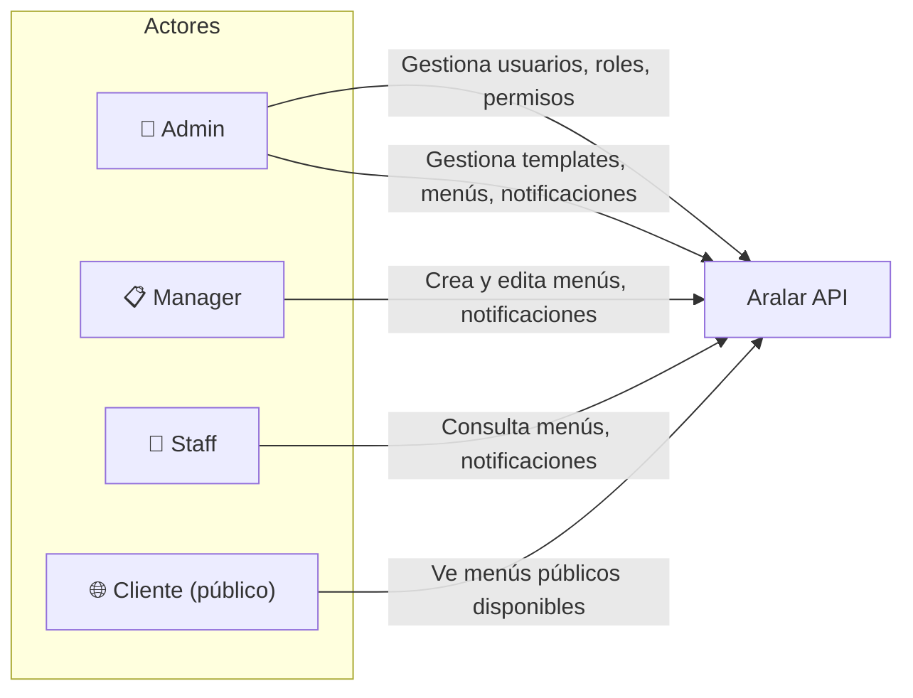
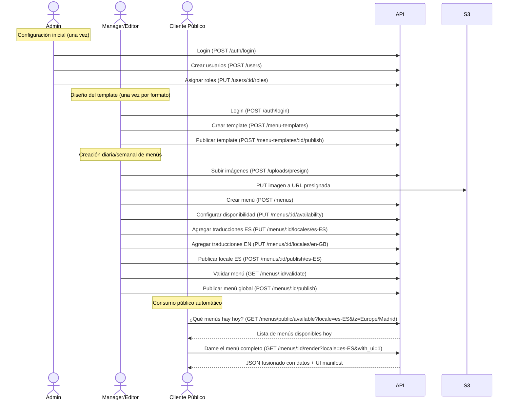

# Aralar Backend API — Visión General para QA

## Propósito del Sistema

Aralar es una plataforma de **gestión de menús digitales para restaurantes**. Permite a los administradores y operadores crear, configurar, traducir y publicar menús que se muestran automáticamente al público según horarios y disponibilidad definidos.

Anteriormente, el restaurante cambiaba manualmente la configuración de sus menús cada día. Con esta solución, los menús se programan con antelación y se publican automáticamente según el día y la hora.

---

## Actores del Sistema

| Actor | Rol | Permisos principales |
|-------|-----|---------------------|
| **Admin** | Administrador del sistema | Todos los permisos (usuarios, roles, templates, menús, notificaciones, tokens) |
| **Manager** | Gestión operativa | Leer usuarios, crear/editar menús, gestionar notificaciones |
| **Staff** | Personal del restaurante | Leer menús, leer notificaciones |
| **Cliente (público)** | Visitante de la web/app | Endpoints públicos: menús disponibles, render, catálogos |

---

## Arquitectura de Módulos

```mermaid
graph TB
    subgraph "Endpoints Protegidos (JWT)"
        AUTH["/api/auth"]
        USERS["/api/users"]
        ROLES["/api/roles"]
        TEMPLATES["/api/menu-templates"]
        MENUS["/api/menus"]
        UPLOADS["/api/uploads"]
        I18N["/api/i18n"]
        NOTIF["/api/notifications"]
    end

    subgraph "Endpoints Públicos (sin JWT)"
        PUB_AVAIL["/api/menus/public/available"]
        PUB_FEAT["/api/menus/public/featured"]
        PUB_RENDER["/api/menus/:id/render"]
        PUB_NOTIF["/api/notifications/active"]
        PUB_CAT["/api/catalogs/allergens"]
    end

    subgraph "Infraestructura"
        DB[(MongoDB)]
        S3[S3 / MinIO Storage]
        TRANSLATE[Proveedor de Traducción]
    end

    AUTH --> DB
    USERS --> DB
    ROLES --> DB
    TEMPLATES --> DB
    MENUS --> DB
    UPLOADS --> S3
    I18N --> TRANSLATE
    NOTIF --> DB

    PUB_AVAIL --> DB
    PUB_FEAT --> DB
    PUB_RENDER --> DB
    PUB_NOTIF --> DB
```

---

## Flujo General de Uso (Caso Real)

---

## Mapa de Endpoints por Módulo

### Auth (`/api/auth`)
| Método | Ruta | Descripción | Permiso |
|--------|------|-------------|---------|
| POST | `/login` | Autenticación, devuelve JWT | Público (rate-limited) |
| GET | `/me` | Info del usuario autenticado | JWT válido |
| POST | `/register` | Registro de nuevo usuario | Público |
| PUT | `/change-password` | Cambiar contraseña propia | JWT válido |
| POST | `/logout` | Cerrar sesión (invalida token) | JWT válido |
| POST | `/invalidate-token` | Invalidar token de otro usuario | `auth:invalidate_tokens` |
| GET | `/blacklist-history/:user_id` | Historial de tokens invalidados | `auth:view_blacklist` |

### Users (`/api/users`)
| Método | Ruta | Descripción | Permiso |
|--------|------|-------------|---------|
| POST | `/` | Crear usuario | `users:create` |
| GET | `/` | Listar usuarios | `users:read` |
| GET | `/:user_id` | Obtener usuario | `users:read` |
| PUT | `/:user_id/permissions` | Asignar permisos directos | `users:assign_permissions` |
| PUT | `/:user_id/roles` | Asignar roles | `users:assign_roles` |
| PUT | `/:user_id/activate` | Activar usuario | `users:activate` |
| PUT | `/:user_id/deactivate` | Desactivar usuario | `users:activate` |
| PUT | `/:user_id/change-password` | Cambiar contraseña de otro | `users:change_password` |

### Roles (`/api/roles`)
| Método | Ruta | Descripción | Permiso |
|--------|------|-------------|---------|
| GET | `/` | Listar roles | `roles:read` |
| POST | `/` | Crear rol | `roles:create` |
| GET | `/:name` | Obtener rol | `roles:read` |
| PUT | `/:name` | Actualizar rol | `roles:update` |
| DELETE | `/:name` | Eliminar rol | `roles:delete` |
| GET | `/permissions` | Listar permisos | `roles:permissions:read` |
| PUT | `/permissions/:name` | Crear/actualizar permiso | `roles:permissions:update` |

### Menu Templates (`/api/menu-templates`)
| Método | Ruta | Descripción | Permiso |
|--------|------|-------------|---------|
| POST | `/` | Crear template | `menu_templates:create` |
| GET | `/` | Listar templates | `menu_templates:read` |
| GET | `/:id` | Obtener template | `menu_templates:read` |
| PUT | `/:id` | Actualizar template (draft) | `menu_templates:update` |
| POST | `/:id/publish` | Publicar template | `menu_templates:publish` |
| POST | `/:id/archive` | Archivar template | `menu_templates:archive` |
| POST | `/:id/unpublish` | Despublicar template | `menu_templates:publish` |

### Menus (`/api/menus`)
| Método | Ruta | Descripción | Permiso |
|--------|------|-------------|---------|
| POST | `/` | Crear menú | `menus:create` |
| GET | `/` | Listar menús | `menus:read` |
| GET | `/:id` | Obtener menú | `menus:read` |
| PUT | `/:id/general` | Editar nombre, featured, featured_order | `menus:update` |
| PUT | `/:id/common` | Actualizar datos comunes (no traducibles) | `menus:update` |
| PUT | `/:id/locales/:locale` | Actualizar traducción de un idioma | `menus:update` |
| PUT | `/:id/availability` | Configurar disponibilidad horaria | `menus:update` |
| PUT | `/:id/featured` | Marcar como destacado | `menus:update` |
| POST | `/:id/publish/:locale` | Publicar un locale específico | `menus:publish` |
| GET | `/:id/validate` | Validar si está listo para publicar | `menus:read` |
| POST | `/:id/publish` | Publicar menú globalmente | `menus:publish` |
| POST | `/:id/unpublish` | Despublicar menú | `menus:publish` |
| POST | `/:id/archive` | Archivar menú | `menus:archive` |
| GET | `/public/available` | Menús disponibles hoy (público) | Público |
| GET | `/public/featured` | Menús destacados (público) | Público |
| POST | `/render/multiple` | Renderizar múltiples menús | Público |
| GET | `/:id/render` | Renderizar menú fusionado (público) | Público |

### Uploads (`/api/uploads`)
| Método | Ruta | Descripción | Permiso |
|--------|------|-------------|---------|
| POST | `/presign` | Obtener URL presignada para subir archivo | `menus:update` |
| POST | `/proxy-put` | Proxy de subida (para testing) | `menus:update` |
| GET | `/presign-info` | Información sobre uso de presigned URLs | Público |
| POST | `/direct` | Subida directa al bucket | `menus:update` |

### I18n (`/api/i18n`)
| Método | Ruta | Descripción | Permiso |
|--------|------|-------------|---------|
| POST | `/translate` | Traducir textos con glosario | `menus:update` |
| POST | `/detect` | Detectar idioma | `menus:update` |
| POST | `/glossaries` | Crear/actualizar glosario | `menus:update` |
| GET | `/glossaries/current` | Obtener glosario actual | `menus:update` |

### Notifications (`/api/notifications`)
| Método | Ruta | Descripción | Permiso |
|--------|------|-------------|---------|
| POST | `/` | Crear notificación | `notifications:create` |
| GET | `/` | Listar notificaciones | `notifications:read` |
| GET | `/:id` | Obtener notificación | `notifications:read` |
| PUT | `/:id` | Actualizar notificación | `notifications:update` |
| DELETE | `/:id` | Eliminar notificación | `notifications:delete` |
| POST | `/:id/toggle` | Activar/desactivar | `notifications:update` |
| GET | `/active` | Notificaciones activas (público) | Público |
| GET | `/location/:location` | Por ubicación | `notifications:read` |
| GET | `/stats` | Estadísticas | `notifications:read` |
| GET | `/expired` | Notificaciones expiradas | `notifications:read` |
| GET | `/upcoming` | Próximas notificaciones | `notifications:read` |
| PUT | `/:id/locales/:locale` | Actualizar traducción | `notifications:update` |

### Catalogs (`/api/catalogs`)
| Método | Ruta | Descripción | Permiso |
|--------|------|-------------|---------|
| GET | `/allergens` | Lista de alérgenos | Público |

---

## Índice de Documentos de Flujo

| Documento | Contenido |
|-----------|-----------|
| [01_AUTH_USERS.md](./01_AUTH_USERS.md) | Autenticación, gestión de usuarios y roles |
| [02_TEMPLATES.md](./02_TEMPLATES.md) | Ciclo de vida de templates |
| [03_MENUS.md](./03_MENUS.md) | Gestión completa de menús |
| [04_PUBLIC_RENDER.md](./04_PUBLIC_RENDER.md) | Endpoints públicos y renderizado |
| [05_NOTIFICATIONS.md](./05_NOTIFICATIONS.md) | Sistema de notificaciones |
| [06_SUPPORT_SERVICES.md](./06_SUPPORT_SERVICES.md) | Uploads, traducciones (i18n), catálogos |
| [07_ER_DIAGRAM.md](./07_ER_DIAGRAM.md) | Diagrama entidad-relación de colecciones MongoDB |
