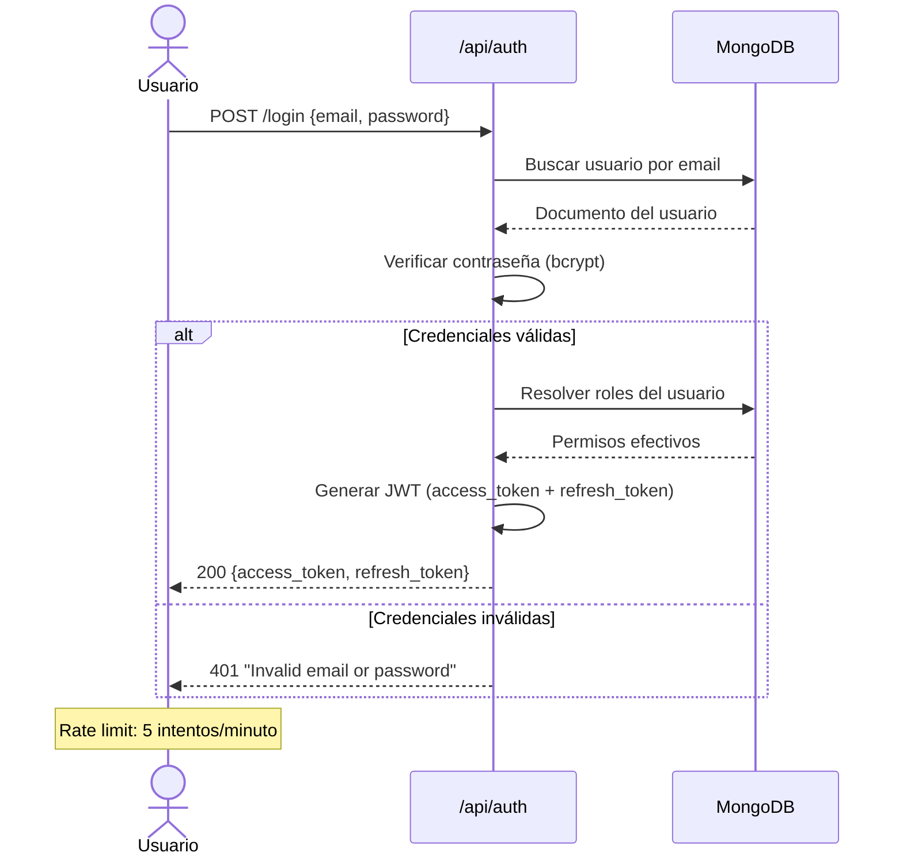
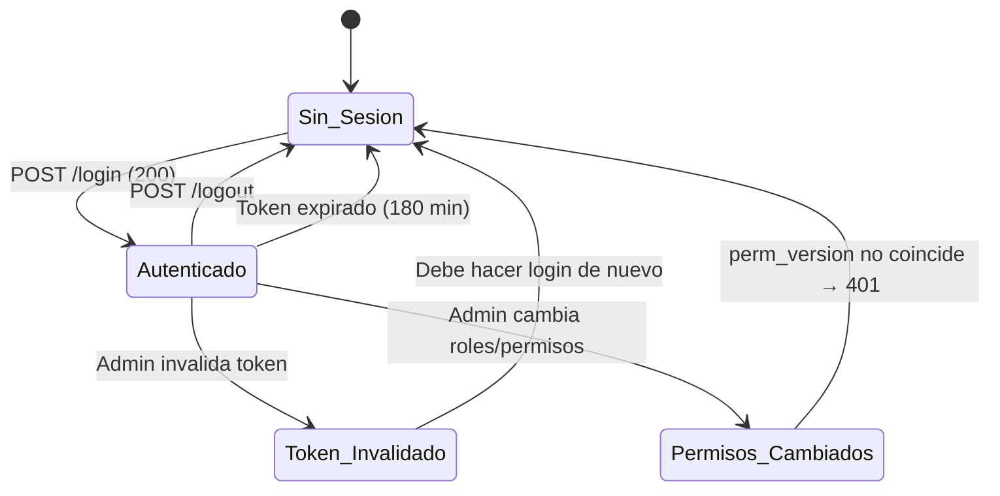
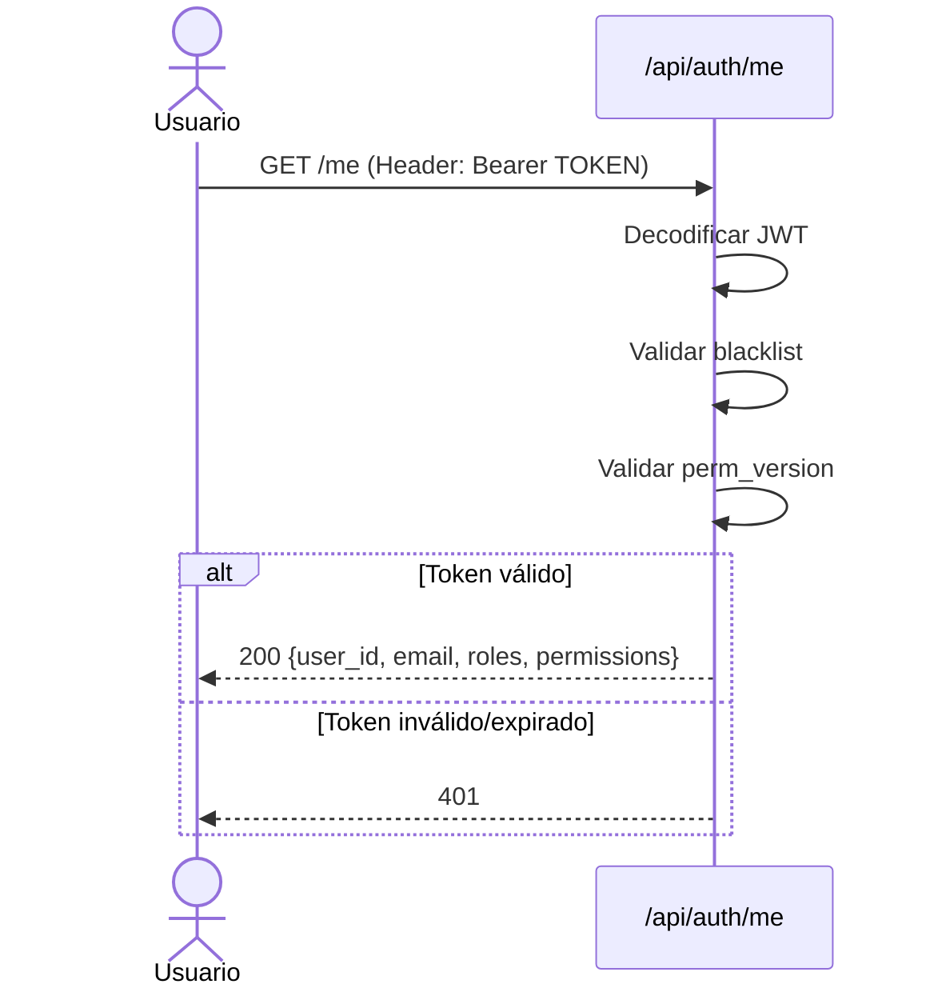
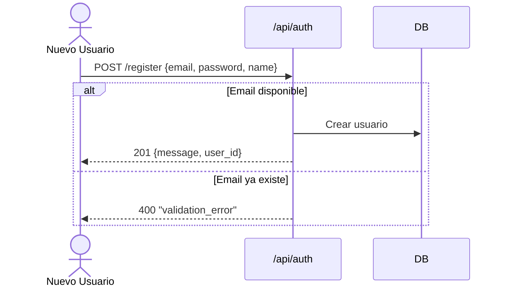
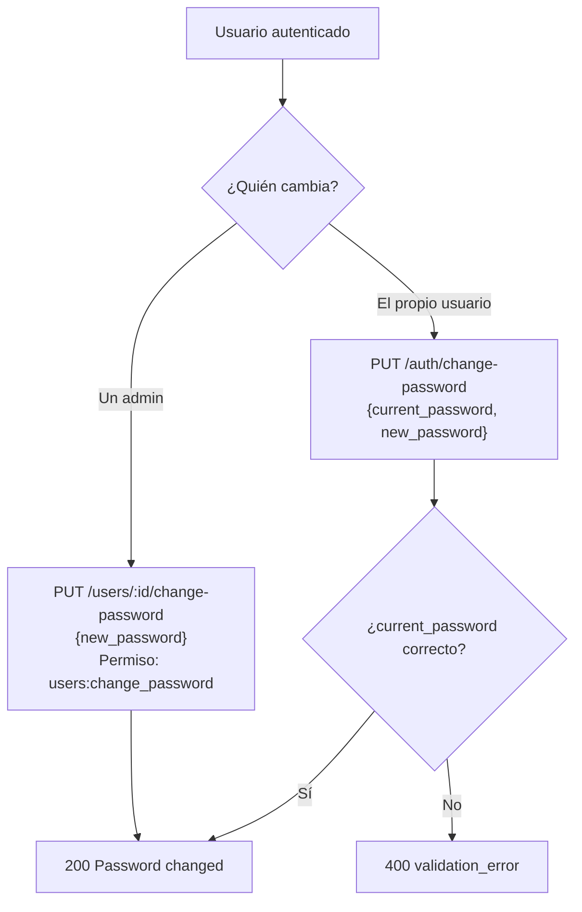
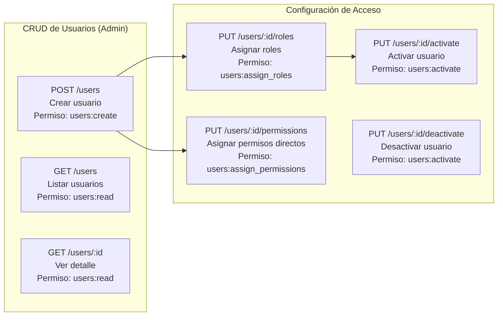
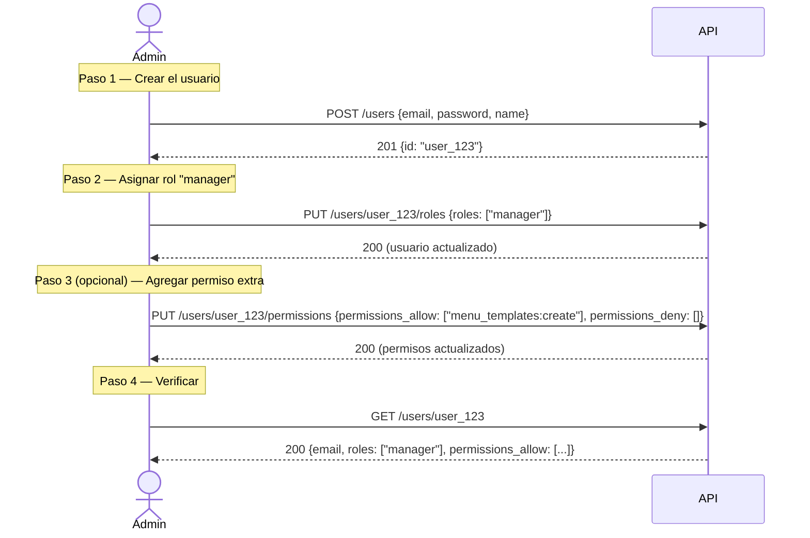
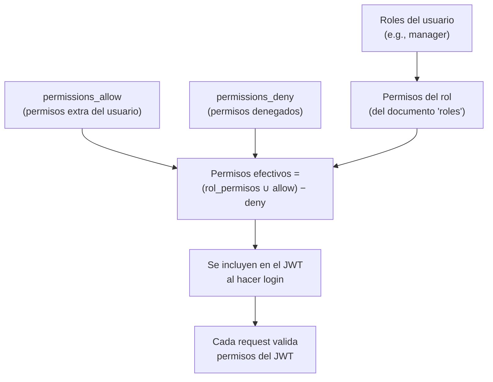
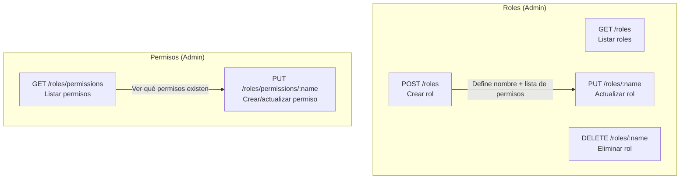
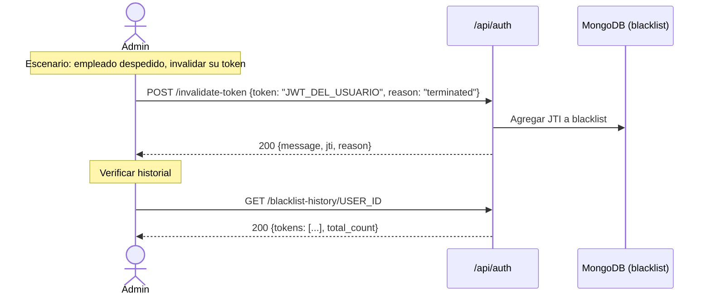

# Flujos de Autenticación y Gestión de Usuarios

## 1. Flujo de Login

**Caso de prueba QA:**
- Login exitoso con credenciales válidas → recibe tokens
- Login con email incorrecto → 401
- Login con password incorrecto → 401
- Login con 6 intentos rápidos → 429 (rate limited)

---

## 2. Ciclo de Vida de Sesión

**Caso de prueba QA:**
- Hacer login → usar token → funciona
- Hacer logout → reusar token → 401
- Admin invalida token de otro usuario → ese token deja de funcionar
- Admin cambia rol del usuario → token existente se rechaza (perm_version)

---

## 3. Consultar Información del Usuario Autenticado

---

## 4. Flujo de Registro

**Caso de prueba QA:**
- Registro con email nuevo → 201
- Registro con email duplicado → 400
- Registro sin campos requeridos → 400

---

## 5. Cambio de Contraseña

---

## 6. Gestión de Usuarios (Admin)

---

## 7. Caso de Uso Completo: Admin Crea un Editor

**Caso de prueba QA:**
- Admin crea usuario → se devuelve ID
- Admin asigna rol → el usuario ahora tiene permisos del rol
- El nuevo usuario hace login → sus permisos incluyen los del rol + allow - deny
- Admin desactiva usuario → el usuario no puede hacer login

---

## 8. Sistema de Permisos (cómo se calculan)

**Ejemplo:**
- Usuario con rol `manager` tiene: `menus:read`, `menus:create`, `menus:update`, etc.
- Se le agrega `permissions_allow: ["menu_templates:create"]` → ahora también puede crear templates
- Se le agrega `permissions_deny: ["notifications:delete"]` → ya no puede borrar notificaciones

---

## 9. Gestión de Roles y Permisos

### Roles predefinidos del sistema

| Rol | Descripción | Permisos clave |
|-----|-------------|----------------|
| `admin` | Administrador total | Todos los permisos |
| `manager` | Gestión operativa | Menús CRUD, notificaciones CRUD, usuarios lectura |
| `staff` | Personal | Solo lectura de menús y notificaciones |
| `user` | Usuario básico | Solo lectura de menús y notificaciones |

---

## 10. Invalidación de Tokens (Admin)

**Caso de prueba QA:**
- Admin invalida token → el usuario afectado recibe 401 en su siguiente request
- Admin consulta historial de blacklist → ve los tokens invalidados
- Usuario normal intenta invalidar token → 403 (sin permiso)
