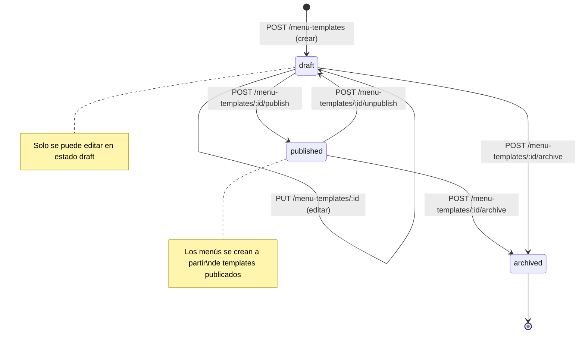
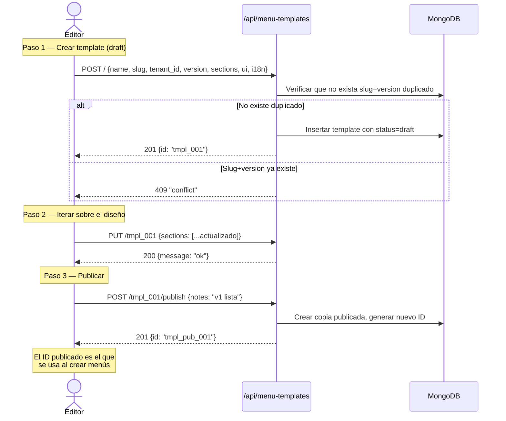
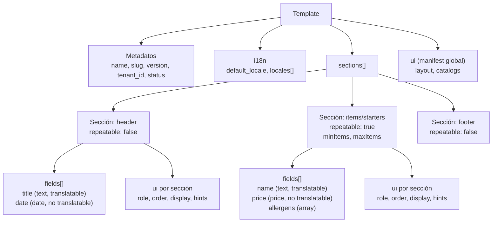
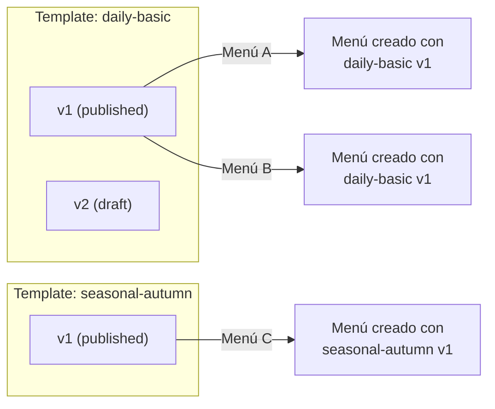
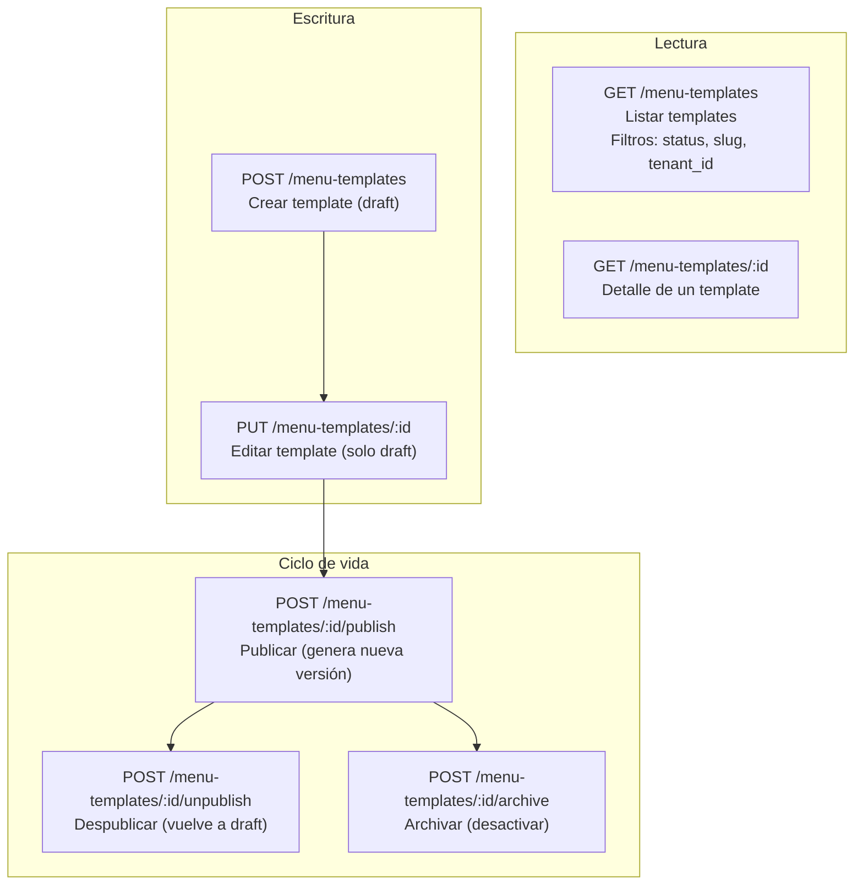

# Flujos de Gestión de Templates

## ¿Qué es un Template?

Un **template** define la **estructura** de un menú: qué secciones tiene (cabecera, platos, postres, vinos…), qué campos tiene cada sección (nombre, precio, imagen, alérgenos…), cuáles son traducibles y cuáles no, y cómo debe renderizarse en el frontend (layout, orden, hints de UI).

Un template se crea una vez y se reutiliza para crear múltiples menús con la misma estructura.

---

## 1. Ciclo de Vida de un Template

**Casos de prueba QA:**
- Crear template → estado `draft`
- Editar template en `draft` → funciona
- Publicar template → estado `published`, se genera nuevo ID de versión publicada
- Intentar editar template `published` → debe fallar o requerir despublicar primero
- Despublicar → vuelve a `draft`
- Archivar → estado `archived`

---

## 2. Flujo Completo: Crear y Publicar un Template

---

## 3. Estructura de un Template (conceptual)

### Tipos de campo comunes

| Tipo | Ejemplo | Traducible |
|------|---------|------------|
| `text` | Nombre del plato, título | Sí (si `translatable: true`) |
| `date` | Fecha del menú | No |
| `price` | Precio del plato | No |
| `image` | Foto del plato | No (URL) |
| `array` | Alérgenos | No |

---

## 4. Slugs y Versionado

- Cada template tiene un `slug` (identificador humano) y una `version` (numérica).
- Al crear un menú, se referencia `template_slug` + `template_version`.
- Un template publicado NO se puede editar; para cambiar la estructura, se crea una nueva versión o se despublica primero.

**Casos de prueba QA:**
- Crear template con slug `daily-basic` versión 1 → OK
- Crear otro template con slug `daily-basic` versión 1 → 409 conflicto
- Crear template con slug `daily-basic` versión 2 → OK (nueva versión)

---

## 5. Operaciones CRUD

---

## 6. Templates Reales del Sistema (ejemplos)

| Slug | Descripción | Secciones principales |
|------|-------------|-----------------------|
| `daily-basic` | Menú del día sencillo | header, items, footer |
| `daily-basic-ui` | Menú del día con UI completo | header, starters, mains, extras, footer |
| `simple-photo` | Menú con fotos | header (banner), dishes (con imágenes) |
| `seasonal-autumn` | Carta estacional | header, starters, mains, desserts, wines, footer |
| `three-sections-multiimages` | Carta 3 secciones con múltiples imágenes | starters, mains_fish, mains_meat, desserts |
| `aralar-allergen-menu` | Menú con alérgenos detallados | header, starters, mains, desserts, extras, footer |

---

## 7. Permisos Requeridos

| Acción | Permiso |
|--------|---------|
| Crear template | `menu_templates:create` |
| Listar / ver templates | `menu_templates:read` |
| Editar template (draft) | `menu_templates:update` |
| Publicar / despublicar | `menu_templates:publish` |
| Archivar | `menu_templates:archive` |

**Caso de prueba QA:**
- Usuario con rol `manager` (sin `menu_templates:create`) intenta crear template → 403
- Admin con todos los permisos puede hacer todas las operaciones
- Manager con permiso extra `menu_templates:create` → puede crear templates
