# Flujos de Gestión de Menús

## ¿Qué es un Menú?

Un **menú** es una instancia concreta creada a partir de un template publicado. Contiene los datos reales del restaurante para un día o periodo: platos, precios, imágenes, traducciones y configuración de disponibilidad.

---

## 1. Ciclo de Vida de un Menú

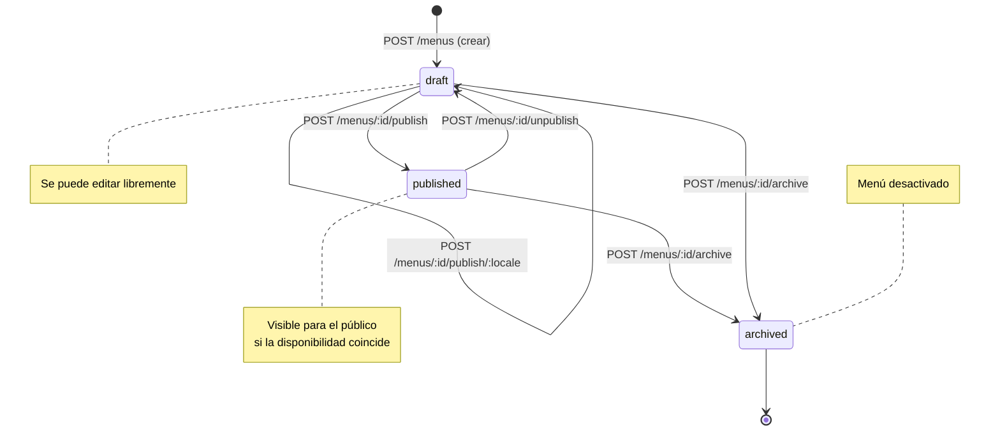

---

## 2. Flujo Completo: Crear un Menú (paso a paso)

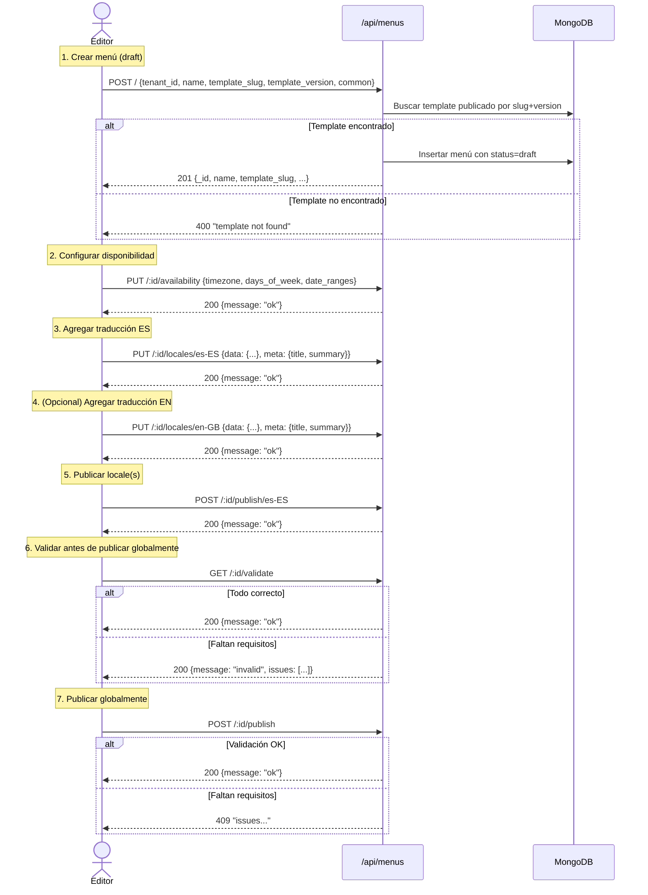

---

## 3. Requisitos para Publicar un Menú

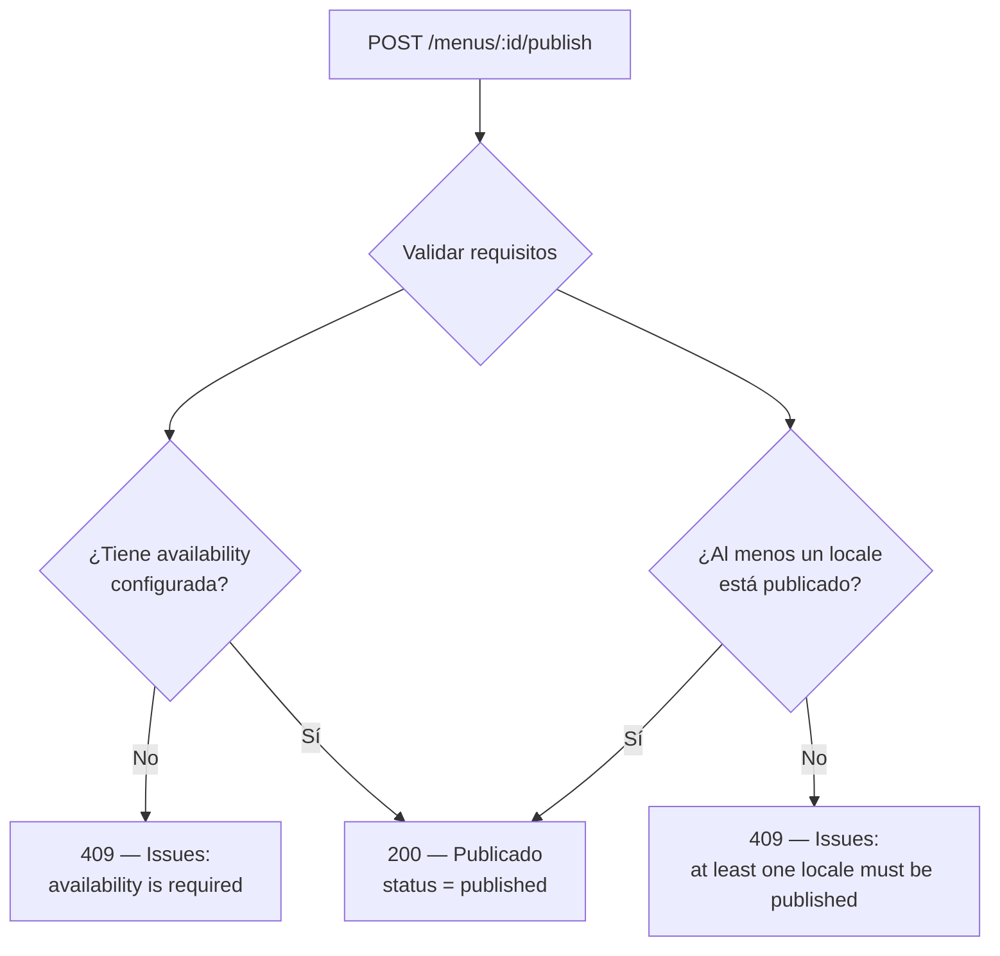

**Casos de prueba QA:**
- Crear menú → publicar sin availability → 409
- Crear menú → agregar availability → publicar sin locales → 409
- Crear menú → availability + locale publicado → publicar → 200

---

## 4. Estructura de Datos del Menú

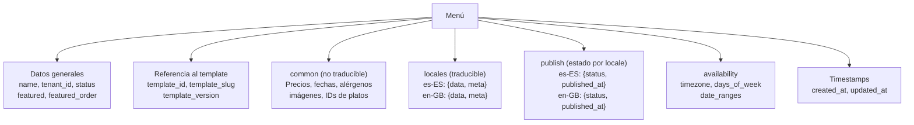

### Separación common vs locales

| Tipo | Dónde va | Ejemplos |
|------|----------|----------|
| **No traducible** | `common` | Precios, fechas, alérgenos, URLs de imágenes, IDs de platos |
| **Traducible** | `locales.{locale}.data` | Nombres de platos, títulos, descripciones |
| **Meta (SEO/UI)** | `locales.{locale}.meta` | `title` y `summary` para listados públicos |

---

## 5. Edición de Datos Comunes (common)

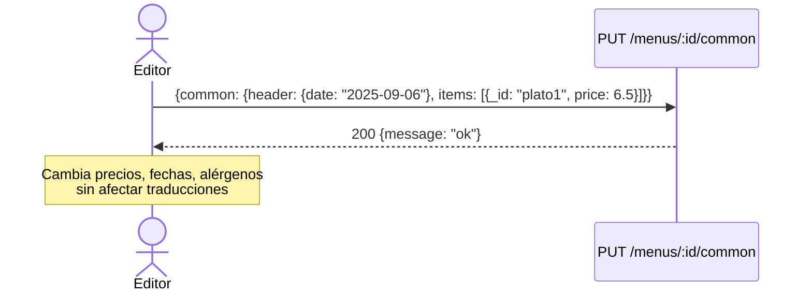

---

## 6. Edición de Propiedades Generales

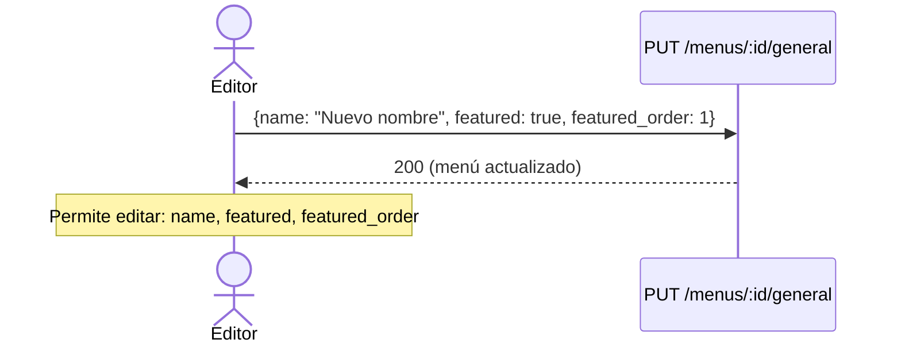

---

## 7. Flujo de Traducciones (Locales)

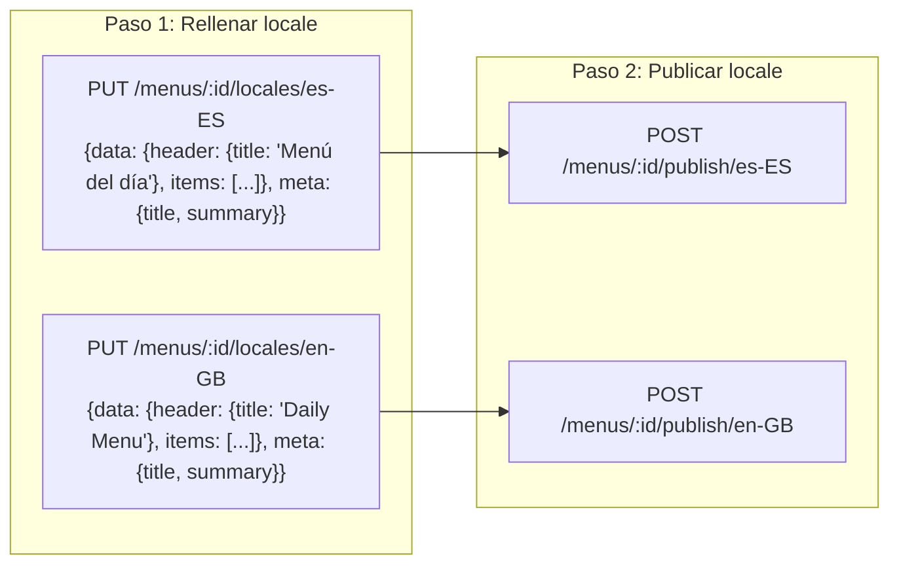

**Casos de prueba QA:**
- Agregar locale `es-ES` → datos guardados correctamente
- Agregar locale `en-GB` → datos guardados sin afectar `es-ES`
- Publicar `es-ES` → el menú se puede consultar en español
- Consultar con `locale=fr-FR&fallback=en-GB` → si no hay `fr-FR`, se usa `en-GB`

---

## 8. Configuración de Disponibilidad

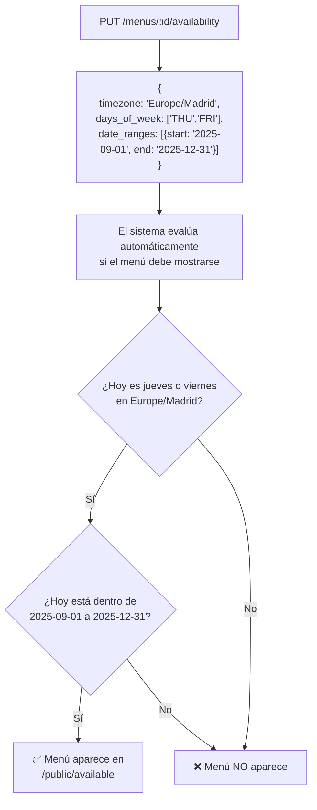

**Casos de prueba QA:**
- Menú disponible solo jueves y viernes → consultar un miércoles → no aparece
- Menú con rango septiembre-diciembre → consultar en enero → no aparece
- Usar `?date=2025-09-05` (viernes) → aparece independientemente del día real

---

## 9. Menú Destacado (Featured)

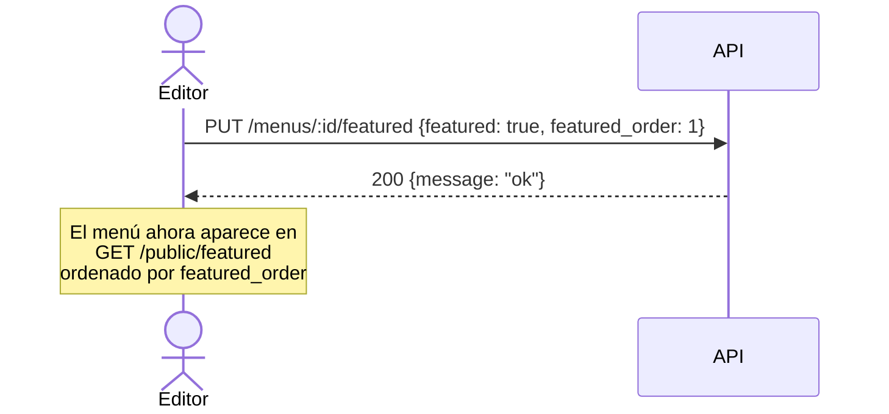

Alternativa usando el endpoint general:
```
PUT /menus/:id/general {featured: true, featured_order: 1}
```

**Casos de prueba QA:**
- Marcar menú como featured → aparece en `/public/featured`
- Desmarcar featured → desaparece de `/public/featured`
- `featured_order` más bajo = mayor prioridad (1 aparece antes que 5)
- Al desmarcar `featured`, `featured_order` se limpia automáticamente a `null`

---

## 10. Archivar / Despublicar

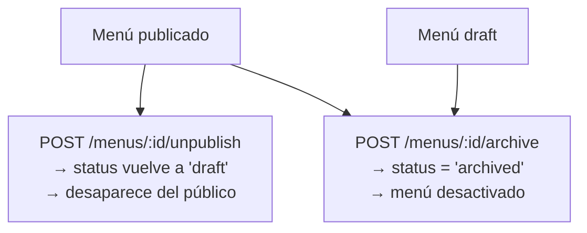

**Casos de prueba QA:**
- Menú publicado → despublicar → ya no aparece en `/public/available`
- Menú publicado → archivar → ya no aparece en ningún listado público
- Archivar menú ya archivado → responde "already archived"

---

## 11. Listado y Búsqueda de Menús (Admin)

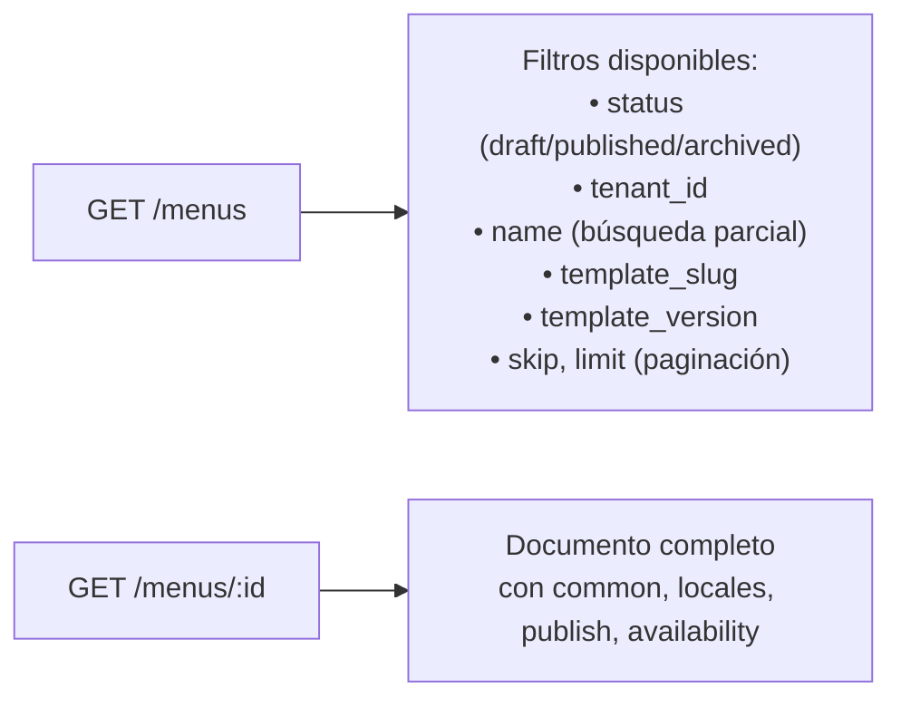

**Casos de prueba QA:**
- Listar sin filtros → todos los menús
- Filtrar por `status=published` → solo publicados
- Filtrar por `name=diario` → búsqueda parcial case-insensitive
- Filtrar por `template_slug=daily-basic` → solo menús de ese template
- Paginación: `skip=0&limit=5` → primeros 5 resultados

---

## 12. Permisos Requeridos

| Acción | Permiso |
|--------|---------|
| Crear menú | `menus:create` |
| Listar / ver menús | `menus:read` |
| Editar common, locales, availability, general, featured | `menus:update` |
| Publicar / despublicar menú y locales | `menus:publish` |
| Archivar menú | `menus:archive` |
| Validar menú | `menus:read` |
