# Flujos Públicos y Renderizado de Menús

## Contexto

Los endpoints públicos son los que consume la **app o web del cliente final** (el comensal). No requieren autenticación JWT. El sistema evalúa automáticamente qué menús mostrar según la fecha, hora, zona horaria y disponibilidad configurada.

---

## 1. Diagrama General de Endpoints Públicos

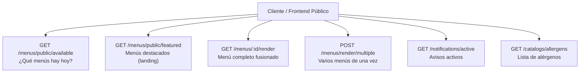

---

## 2. Menús Disponibles Hoy

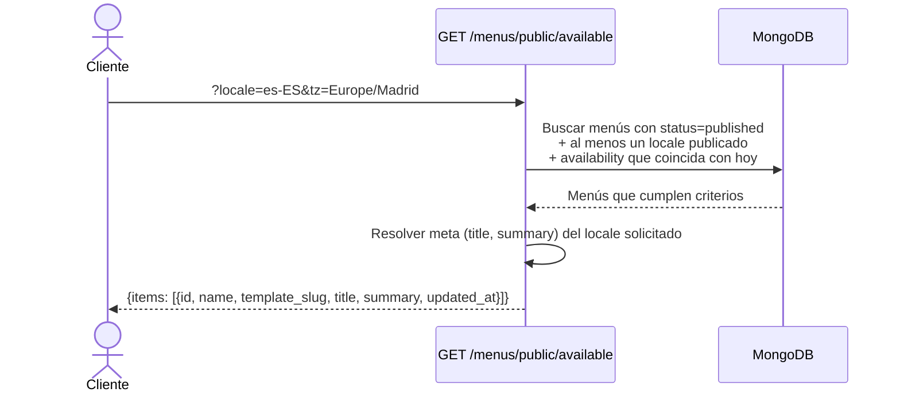

### Parámetros

| Param | Requerido | Descripción |
|-------|-----------|-------------|
| `locale` | Sí | Idioma preferido (e.g., `es-ES`) |
| `tz` | No (default: `Europe/Madrid`) | Zona horaria para evaluar disponibilidad |
| `fallback` | No | Idioma fallback si no existe el locale solicitado |
| `date` | No | Fecha específica para simular (e.g., `2025-09-05`) |

### Lógica de disponibilidad

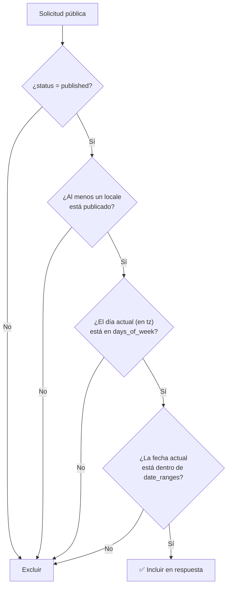

**Casos de prueba QA:**
- Consultar sin parámetro `date` → evalúa la fecha/hora actual
- Consultar con `date=2025-09-05` (viernes) → muestra menús disponibles ese viernes
- Menú publicado sin availability → NO aparece
- Menú con availability pero no publicado → NO aparece
- Menú publicado + disponible hoy → aparece con `title` y `summary` del locale
- Consultar con `locale=fr-FR&fallback=en-GB` → si no hay `fr-FR`, usa `en-GB` para title/summary

---

## 3. Menús Destacados (Featured)

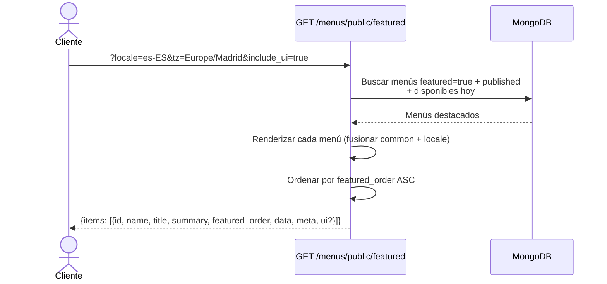

### Diferencia con `/public/available`

| Aspecto | `/public/available` | `/public/featured` |
|---------|--------------------|--------------------|
| **Filtro** | Todos los publicados + disponibles | Solo los marcados como `featured` |
| **Datos** | Resumen (id, title, summary) | Menú renderizado completo (data + meta) |
| **Uso** | Listado general de menús | Landing page / carrusel de destacados |
| **UI** | No incluye | Puede incluir (`include_ui=true`) |

**Casos de prueba QA:**
- Menú featured + publicado + disponible → aparece en featured
- Menú featured pero no publicado → NO aparece
- Ordenamiento: `featured_order=1` aparece antes que `featured_order=5`
- Con `include_ui=true` → respuesta incluye manifest de UI del template

---

## 4. Renderizar un Menú Específico

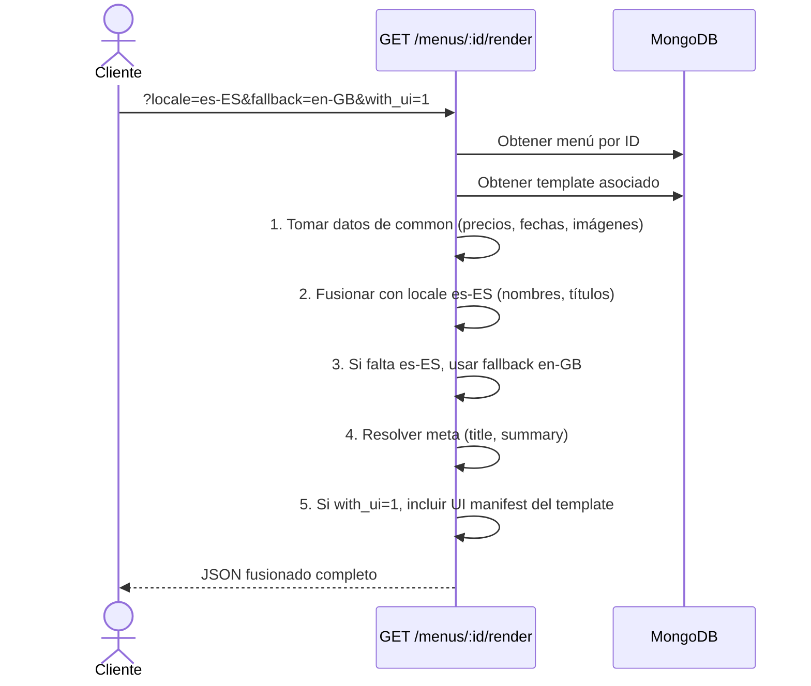

### Proceso de Fusión (Merge)

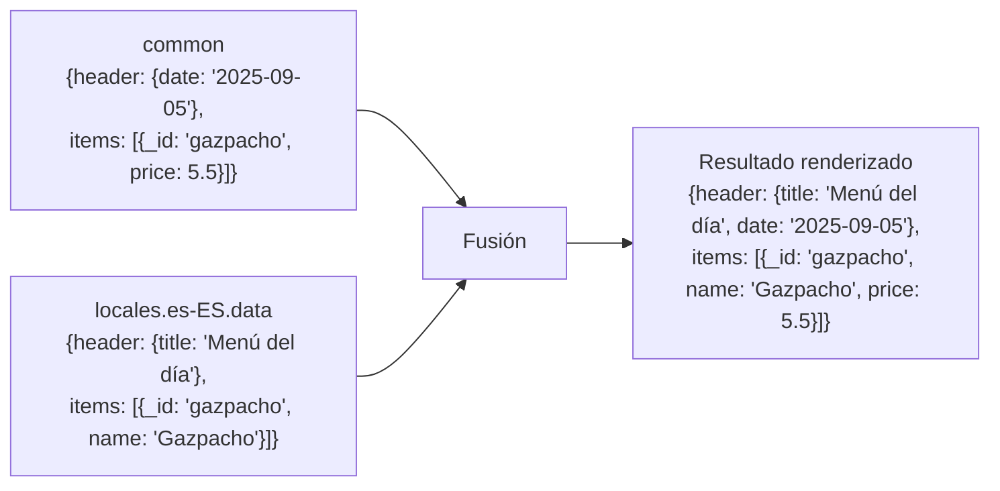

### Estructura de la Respuesta

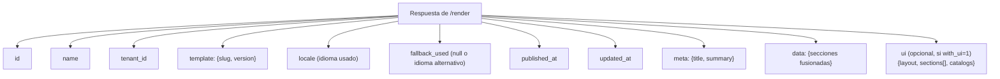

### Fallback de Idioma

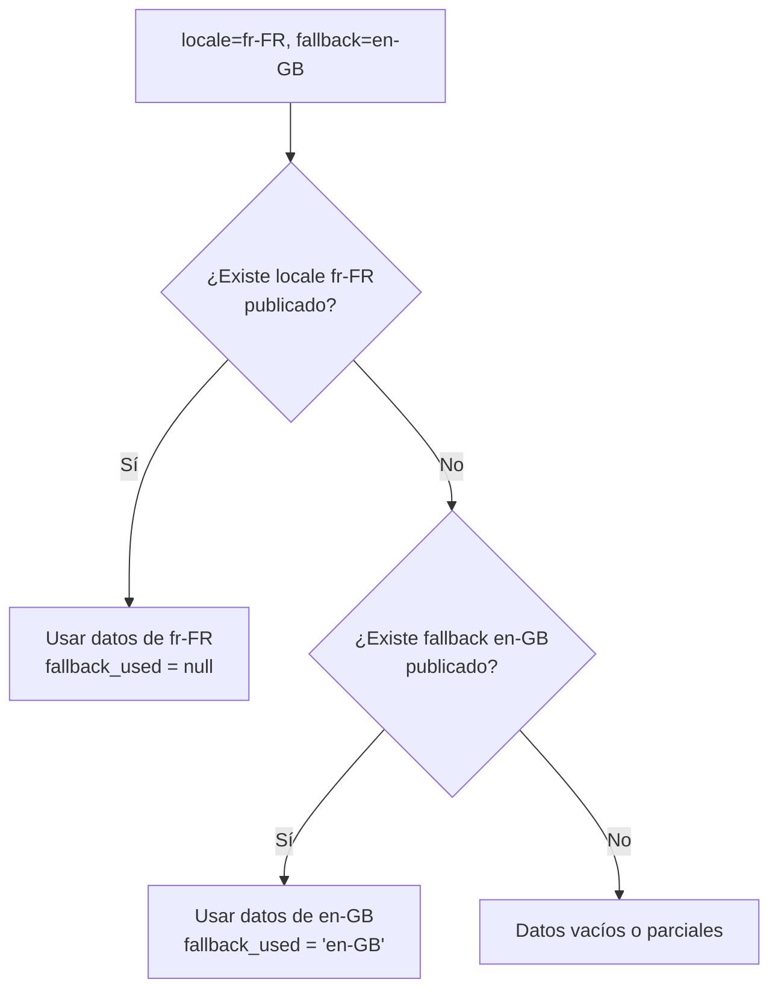

**Casos de prueba QA:**
- Render con `locale=es-ES` → datos en español, `fallback_used=null`
- Render con `locale=fr-FR&fallback=en-GB` → si no hay FR, usa EN, `fallback_used="en-GB"`
- Render con `with_ui=1` → incluye secciones UI con roles, order, display, hints
- Render sin `with_ui` → no incluye manifest UI
- Render con ID inválido → 400
- Render sin locale → 400

---

## 5. Renderizar Múltiples Menús

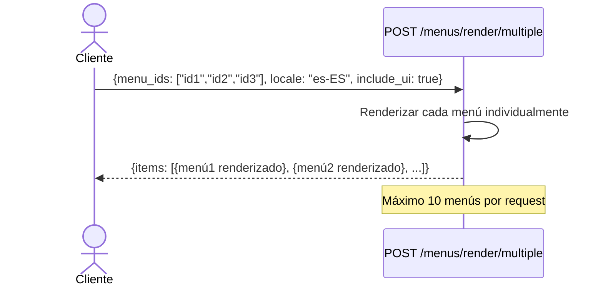

**Casos de prueba QA:**
- Enviar 3 IDs válidos → recibe 3 menús renderizados
- Enviar más de 10 IDs → validación de límite
- Enviar ID inválido → 400

---

## 6. Flujo Completo del Cliente

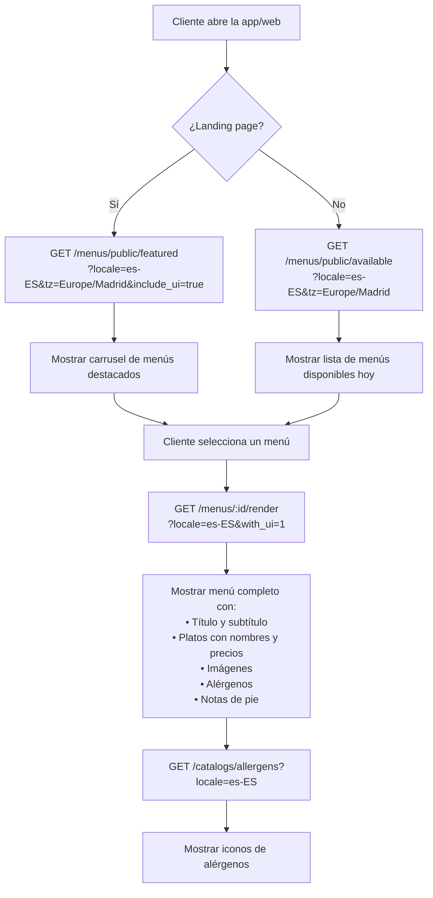

---

## 7. Catálogo de Alérgenos (Público)

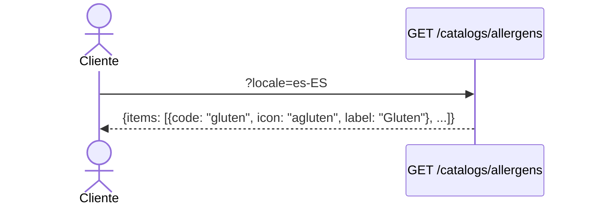

Los 14 alérgenos europeos están disponibles:

| Código | Icono | ES | EN |
|--------|-------|----|----|
| gluten | agluten | Gluten | Gluten |
| crustaceans | acrusta | Crustáceos | Crustaceans |
| eggs | aegg | Huevos | Eggs |
| fish | afish | Pescado | Fish |
| peanuts | apeanut | Cacahuetes | Peanuts |
| soy | asoy | Soja | Soy |
| milk | amilk | Leche/Lactosa | Milk |
| nuts | anuts | Frutos secos | Tree nuts |
| celery | acelery | Apio | Celery |
| mustard | amustard | Mostaza | Mustard |
| sesame | asesame | Sésamo | Sesame |
| sulfites | asulfite | Sulfitos | Sulphites |
| lupin | alupin | Altramuces | Lupin |
| molluscs | amollusc | Moluscos | Molluscs |

**Casos de prueba QA:**
- Sin locale → devuelve todos los campos (labels multi-idioma)
- Con `locale=es-ES` → incluye campo `label` en español
- Con `locale=en-GB` → incluye campo `label` en inglés
