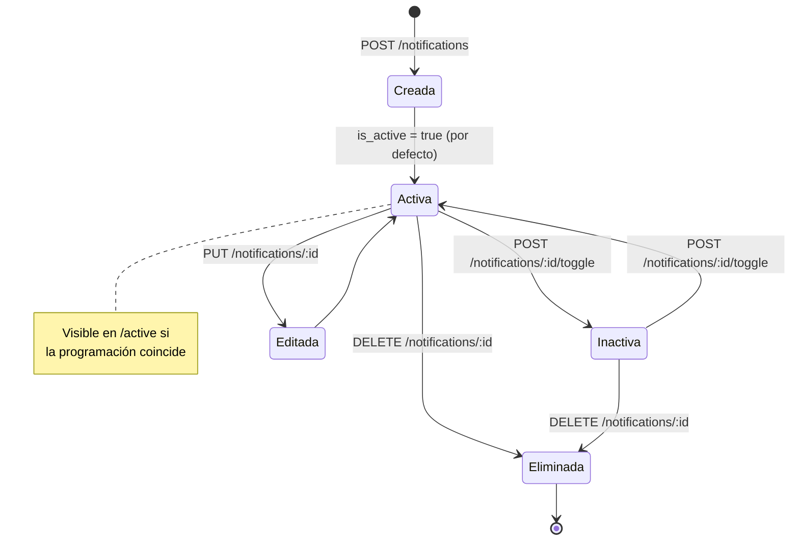
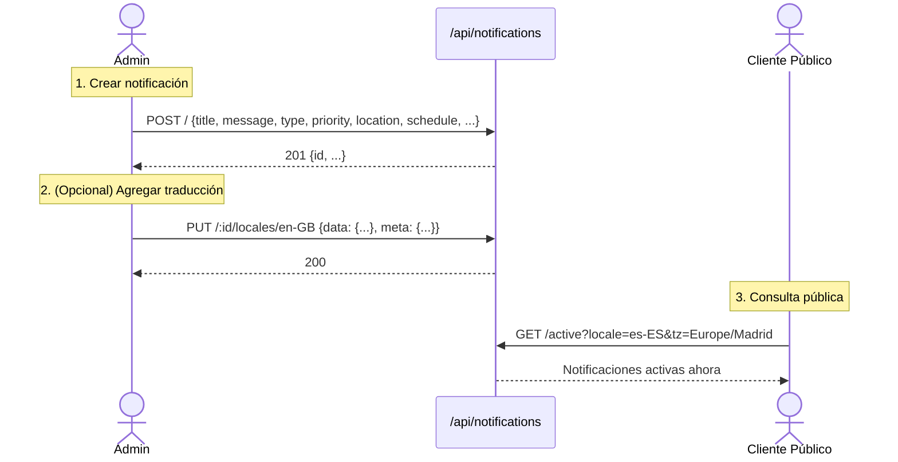
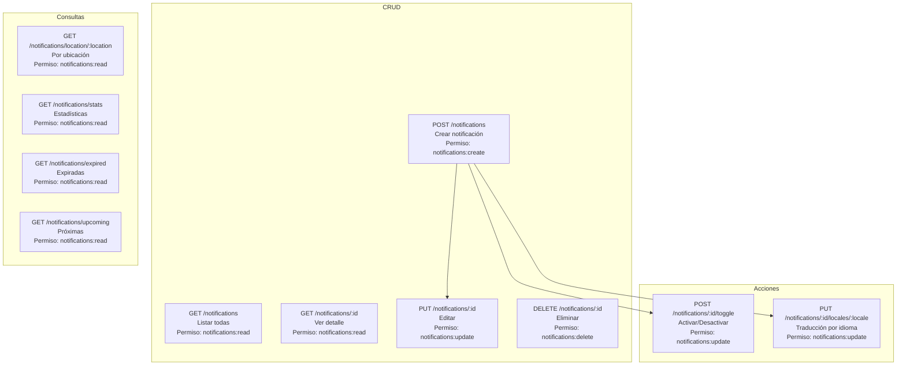
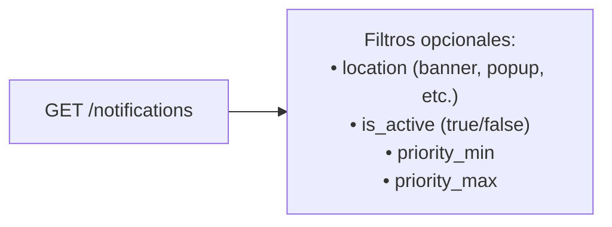
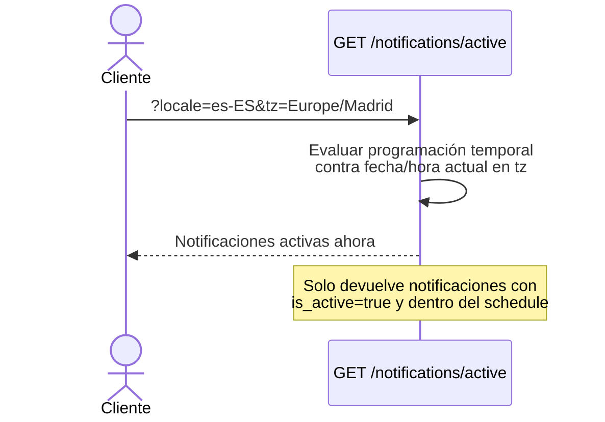
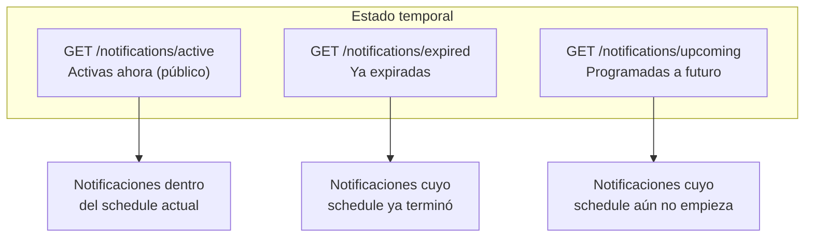
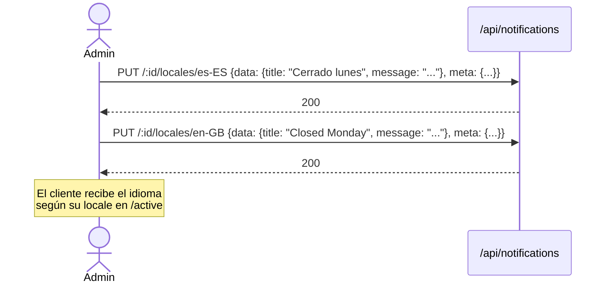
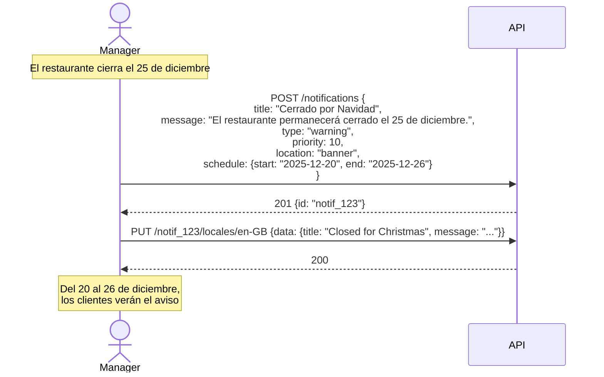

# Flujos de Notificaciones

## ¿Qué es una Notificación?

Las **notificaciones** son avisos o mensajes que el restaurante puede mostrar a sus clientes en la app/web. Pueden ser banners, alertas de horario, promociones, avisos de cierre, etc. Soportan multi-idioma, programación temporal y ubicación en la interfaz.

---

## 1. Ciclo de Vida de una Notificación

---

## 2. Flujo Completo: Crear y Mostrar una Notificación

---

## 3. Operaciones CRUD (Admin/Manager)

---

## 4. Filtros de Listado

**Casos de prueba QA:**
- Listar sin filtros → todas las notificaciones
- Filtrar por `location=banner` → solo banners
- Filtrar por `is_active=true` → solo activas
- Filtrar por prioridad → rango de prioridades

---

## 5. Endpoint Público: Notificaciones Activas

**Casos de prueba QA:**
- Notificación activa + dentro del horario → aparece
- Notificación activa + fuera del horario → NO aparece
- Notificación inactiva → NO aparece (independientemente del horario)
- Sin parámetros → usa timezone por defecto del tenant

---

## 6. Consultas Temporales (Admin)

**Casos de prueba QA:**
- Notificación con `end_date` en el pasado → aparece en `/expired`
- Notificación con `start_date` en el futuro → aparece en `/upcoming`
- Notificación vigente ahora → aparece en `/active`

---

## 7. Traducciones de Notificaciones

---

## 8. Permisos Requeridos

| Acción | Permiso |
|--------|---------|
| Crear notificación | `notifications:create` |
| Listar / ver notificaciones | `notifications:read` |
| Editar / toggle / traducir | `notifications:update` |
| Eliminar notificación | `notifications:delete` |
| Ver activas (público) | Sin autenticación |

---

## 9. Caso Real: Aviso de Cierre por Festivo

