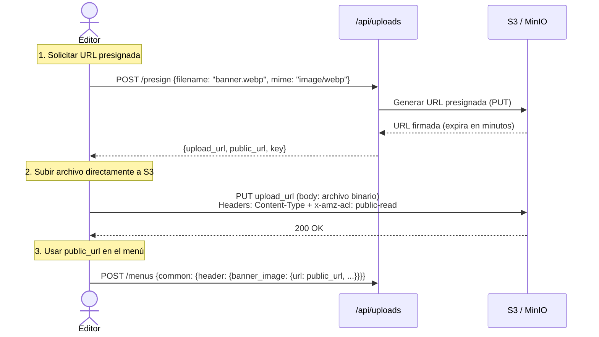
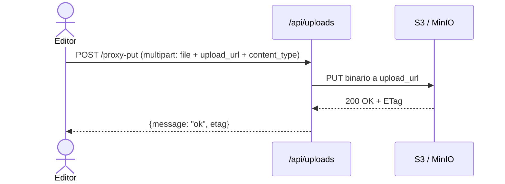
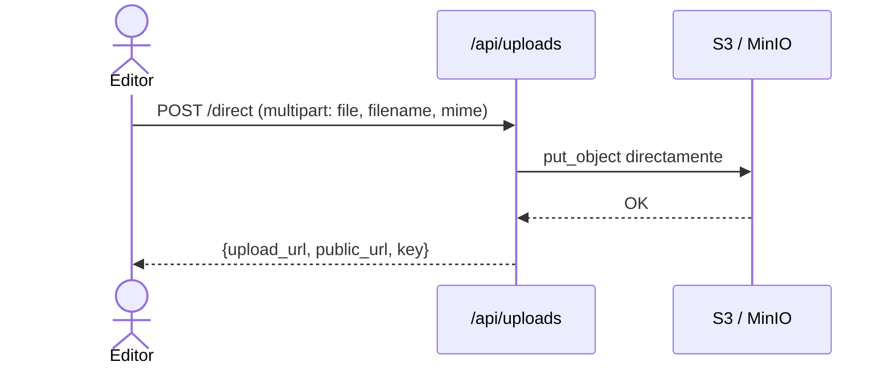
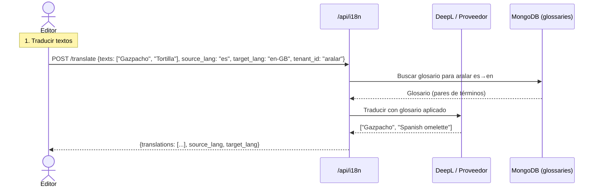
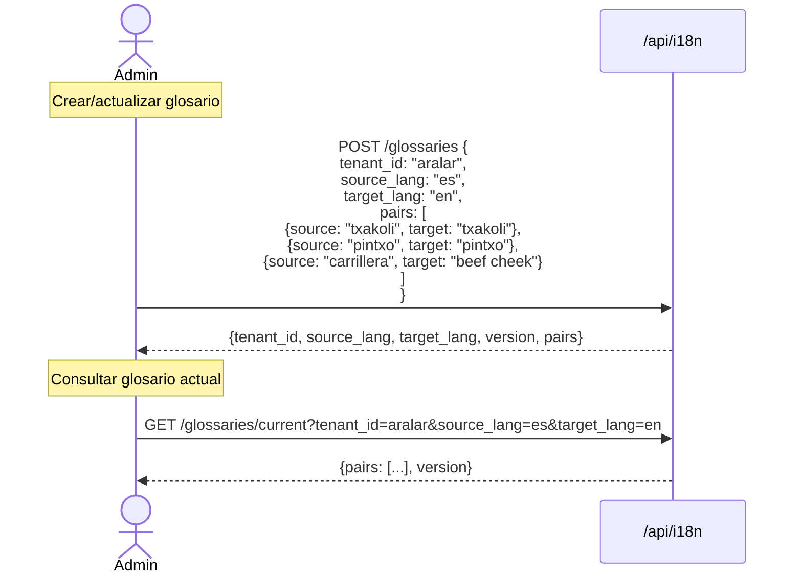
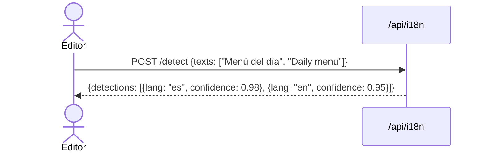
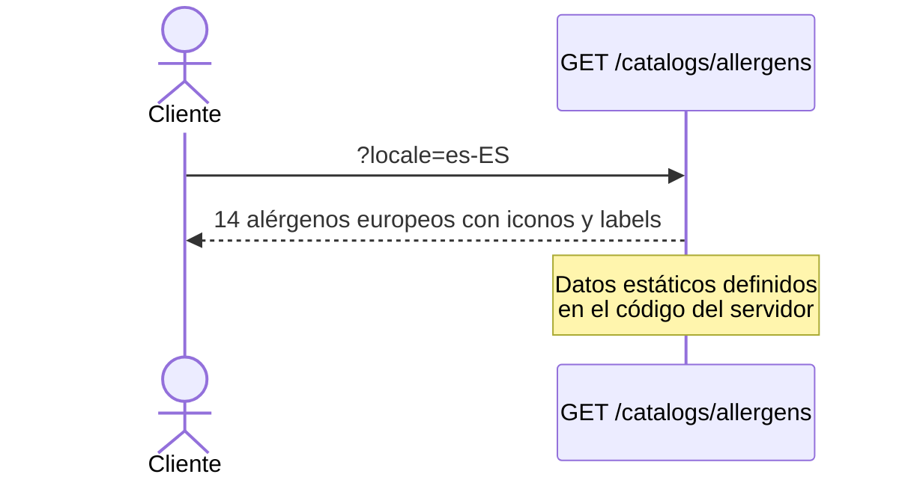
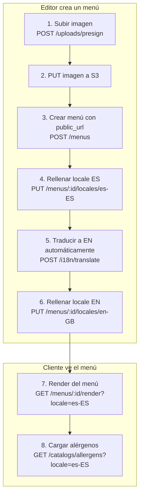

# Servicios de Soporte: Uploads, Traducciones (i18n) y Catálogos

## 1. Uploads (Subida de Imágenes)

### ¿Para qué sirve?

Los menús pueden incluir imágenes (banners, fotos de platos). El sistema usa **S3/MinIO** como almacenamiento. Hay dos formas de subir archivos: mediante **URLs presignadas** (recomendado para frontend) o **subida directa** por el backend.

---

### Flujo con URL Presignada (recomendado)

### Flujo con Proxy (para testing)

### Subida Directa (sin presigned)

### Endpoints de Uploads

| Método | Ruta | Descripción | Permiso |
|--------|------|-------------|---------|
| POST | `/presign` | Obtener URL presignada | `menus:update` |
| POST | `/proxy-put` | Proxy de subida (testing) | `menus:update` |
| POST | `/direct` | Subida directa al bucket | `menus:update` |
| GET | `/presign-info` | Info de uso de presigned URLs | Público |
| GET | `/bucket-exists-boto` | Verificar que el bucket existe | `menus:update` |

**Casos de prueba QA:**
- Solicitar presign → recibe `upload_url` y `public_url` válidas
- Subir archivo a `upload_url` con headers correctos → 200
- Subir archivo sin `x-amz-acl: public-read` → puede fallar
- Subir archivo con `Content-Type` diferente al del presign → puede fallar
- Subida directa → recibe `public_url` accesible
- `GET /presign-info` → documentación de uso

---

## 2. Traducciones (i18n)

### ¿Para qué sirve?

El sistema soporta **múltiples idiomas** para los menús. El servicio de traducción permite:
- Traducir textos automáticamente (usando DeepL u otro proveedor)
- Detectar el idioma de un texto
- Gestionar glosarios personalizados por tenant (para que términos como "txakoli" no se traduzcan mal)

---

### Flujo de Traducción

### Gestión de Glosarios

### Detección de Idioma

### Endpoints de i18n

| Método | Ruta | Descripción | Permiso |
|--------|------|-------------|---------|
| POST | `/translate` | Traducir textos con glosario | `menus:update` |
| POST | `/detect` | Detectar idioma | `menus:update` |
| POST | `/glossaries` | Crear/actualizar glosario | `menus:update` |
| GET | `/glossaries/current` | Obtener glosario vigente | `menus:update` |

**Casos de prueba QA:**
- Traducir texto sencillo → respuesta correcta
- Traducir con glosario → términos del glosario se respetan
- Traducir sin glosario (`use_glossary: false`) → traducción estándar
- Detectar idioma → devuelve código de idioma + confianza
- Crear glosario → se guarda con versión
- Actualizar glosario → incrementa versión
- Consultar glosario inexistente → 404

---

## 3. Catálogos

### ¿Para qué sirve?

Proporciona datos de referencia estáticos que el frontend necesita, como la lista de **alérgenos europeos** con sus iconos y etiquetas multi-idioma.

---

### Catálogo de Alérgenos

**Endpoint único:**

| Método | Ruta | Descripción | Permiso |
|--------|------|-------------|---------|
| GET | `/allergens` | Lista de 14 alérgenos europeos | Público |

**Parámetro opcional:** `locale` — si se especifica, agrega campo `label` en ese idioma.

**Casos de prueba QA:**
- `GET /catalogs/allergens` → 14 alérgenos con `labels` multi-idioma
- `GET /catalogs/allergens?locale=es-ES` → incluye campo `label` en español
- `GET /catalogs/allergens?locale=en-GB` → incluye campo `label` en inglés
- Los iconos corresponden a los códigos de alérgeno (e.g., `gluten` → `agluten`)

---

## 4. Diagrama de Integración de Servicios de Soporte

Este diagrama muestra cómo los tres servicios de soporte se integran en el flujo principal de creación y visualización de menús.
