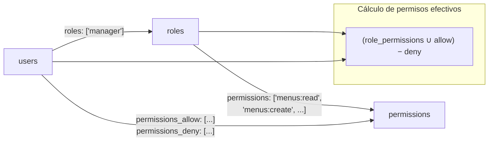
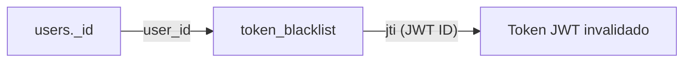
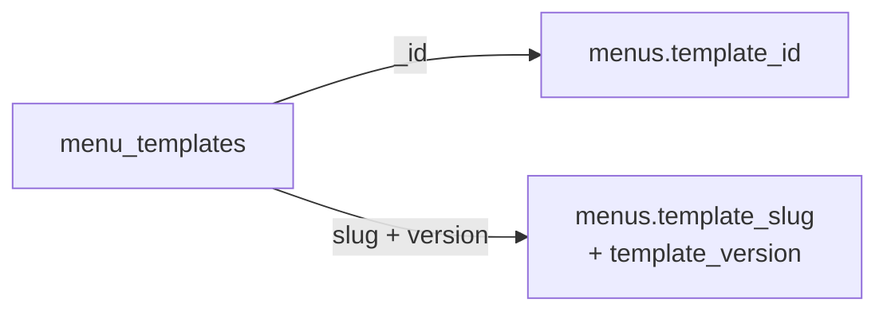
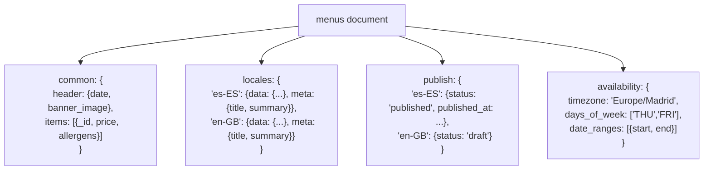
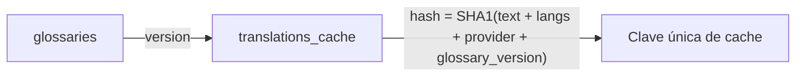

# Diagrama Entidad-Relación — Colecciones MongoDB

## Diagrama General de Relaciones

```mermaid
erDiagram
    USERS ||--o{ TOKEN_BLACKLIST : "tokens invalidados"
    USERS }o--o{ ROLES : "tiene roles[]"
    ROLES }o--o{ PERMISSIONS : "tiene permissions[]"
    USERS }o--o{ PERMISSIONS : "allow[] / deny[]"

    MENU_TEMPLATES ||--o{ MENUS : "template_id / slug+version"

    MENUS ||--o| AVAILABILITY : "embebido"
    MENUS ||--o{ LOCALE_DATA : "embebido en locales{}"
    MENUS ||--o{ PUBLISH_STATUS : "embebido en publish{}"

    NOTIFICATIONS ||--o| SCHEDULING : "embebido"
    NOTIFICATIONS ||--o| DISPLAY : "embebido"
    NOTIFICATIONS ||--o{ NOTIF_LOCALE : "embebido en locales{}"

    GLOSSARIES ||--o{ TRANSLATIONS_CACHE : "glossary_version"

    USERS {
        ObjectId _id PK
        string email UK "único"
        string password "bcrypt hash"
        string full_name
        string[] roles FK "nombres de roles"
        string[] permissions_allow "permisos extra"
        string[] permissions_deny "permisos denegados"
        boolean active "default true"
        int perm_version "versión de permisos"
        datetime created_at
        datetime updated_at
    }

    ROLES {
        ObjectId _id PK
        string name UK "único: admin, manager, staff, user"
        string description
        string[] permissions "lista de nombres de permiso"
    }

    PERMISSIONS {
        ObjectId _id PK
        string name UK "único: menus:read, users:create, etc."
        string description
    }

    TOKEN_BLACKLIST {
        ObjectId _id PK
        string jti UK "JWT ID único"
        string user_id FK "→ users._id"
        datetime blacklisted_at
        datetime expires_at "TTL auto-limpieza"
        string reason "logout | admin_action | security"
    }

    MENU_TEMPLATES {
        ObjectId _id PK
        string name "nombre descriptivo"
        string slug "identificador: daily-basic"
        int version "1, 2, 3..."
        string status "draft | published | archived"
        string tenant_id
        object i18n "default_locale, locales[]"
        array sections "secciones con fields[]"
        object ui "layout, catalogs"
        string publish_notes
        datetime created_at
        datetime updated_at
    }

    MENUS {
        ObjectId _id PK
        string tenant_id
        string name "nombre del menú"
        ObjectId template_id FK "→ menu_templates._id"
        string template_slug "slug del template"
        int template_version "versión del template"
        string status "draft | published | archived"
        object common "datos no traducibles"
        object locales "datos por idioma"
        object publish "estado por locale"
        object availability "embebido"
        boolean featured "menú destacado"
        int featured_order "orden de prioridad"
        datetime created_at
        datetime updated_at
    }

    AVAILABILITY {
        string timezone "Europe/Madrid"
        string[] days_of_week "MON TUE WED..."
        array date_ranges "start+end dates"
    }

    LOCALE_DATA {
        string locale_key "es-ES, en-GB..."
        object data "campos traducidos"
        object meta "title, summary"
    }

    PUBLISH_STATUS {
        string locale_key "es-ES, en-GB..."
        string status "draft | published"
        datetime published_at
    }

    NOTIFICATIONS {
        ObjectId _id PK
        string name UK "nombre único"
        boolean is_active "default true"
        int priority "1-100"
        object scheduling "embebido"
        object display "embebido"
        object locales "datos por idioma"
        object i18n "default_locale, locales[]"
        datetime created_at
        datetime updated_at
    }

    SCHEDULING {
        datetime start_date
        datetime end_date
        string[] days_of_week "SUN MON TUE..."
        string time_start "HH:MM"
        string time_end "HH:MM"
    }

    DISPLAY {
        string location "top-bar | hero-section | footer..."
        string type "banner | card | modal | toast"
        object style "background_color, text_color, css_class"
    }

    NOTIF_LOCALE {
        string locale_key "es-ES, en-GB..."
        object data "contenido traducido"
        object meta "metadatos"
    }

    GLOSSARIES {
        ObjectId _id PK
        string tenant_id "aralar, restaurant-123..."
        string source_lang "es, eu, en..."
        string target_lang "en, es, fr..."
        int version "auto-incrementa"
        array pairs "source-target word pairs"
    }

    TRANSLATIONS_CACHE {
        ObjectId _id PK
        string hash UK "SHA1 de text+langs+provider+glossary_v"
        string tenant_id
        string source "texto original"
        string translated "texto traducido"
        string provider "deepl | google"
        int glossary_version
        datetime created_at
    }
```

---

## Detalle de Relaciones

### 1. Users ↔ Roles ↔ Permissions

- **users.roles[]** → array de strings que referencian **roles.name**
- **roles.permissions[]** → array de strings que referencian **permissions.name**
- **users.permissions_allow[]** / **permissions_deny[]** → override directo de permisos
- No hay foreign keys reales (es MongoDB), la integridad se mantiene en la capa de servicio.

### 2. Users ↔ Token Blacklist

- **token_blacklist.user_id** → string que referencia **users._id**
- Un usuario puede tener múltiples tokens en la blacklist (logout múltiple, invalidación admin)
- TTL index en `expires_at` limpia automáticamente tokens expirados

### 3. Menu Templates → Menus

- Los menús referencian al template de dos formas:
  - **menus.template_id** → ObjectId del template (referencia directa)
  - **menus.template_slug** + **menus.template_version** → referencia por slug/versión
- Un template puede tener múltiples menús (1:N)

### 4. Menus — Documentos Embebidos

- **common**, **locales**, **publish** y **availability** son subdocumentos embebidos (no colecciones separadas)
- `locales` y `publish` usan claves dinámicas (`es-ES`, `en-GB`, etc.)

### 5. Glossaries → Translations Cache

- El cache se invalida indirectamente: al cambiar la versión del glosario, el hash cambia y se generan nuevas entradas de cache
- **glossaries** tiene índice compuesto lógico: `tenant_id + source_lang + target_lang`

---

## Índices Importantes

| Colección | Campo(s) | Tipo | Propósito |
|-----------|----------|------|-----------|
| `users` | `email` | unique | Login por email |
| `roles` | `name` | unique | Búsqueda por nombre de rol |
| `permissions` | `name` | unique | Búsqueda por nombre de permiso |
| `token_blacklist` | `jti` | unique | Verificar token invalidado |
| `token_blacklist` | `expires_at` | TTL | Auto-limpieza de tokens expirados |
| `menu_templates` | `slug` + `version` | unique compound | Evitar duplicados slug+versión |
| `menus` | `status` + `availability.*` | compound | Consultas públicas de disponibilidad |
| `notifications` | `name` | unique | Nombre único de notificación |
| `notifications` | `is_active` + `scheduling.*` | compound | Consultas de notificaciones activas |
| `notifications` | `display.location` + `priority` | compound | Consultas por ubicación |
| `glossaries` | `tenant_id` + `source_lang` + `target_lang` | compound lógico | Buscar glosario de un tenant |
| `translations_cache` | `hash` | unique | Evitar duplicados de cache |

---

## Resumen de Colecciones

| Colección | Documentos típicos | Relaciones |
|-----------|-------------------|------------|
| `users` | Usuarios del sistema | → roles (por nombre), → permissions (por nombre) |
| `roles` | admin, manager, staff, user | ← users.roles[], → permissions (por nombre) |
| `permissions` | menus:read, users:create, etc. | ← roles.permissions[], ← users.allow/deny |
| `token_blacklist` | Tokens JWT invalidados | → users (por user_id) |
| `menu_templates` | Estructuras de menú reutilizables | ← menus (por template_id o slug+version) |
| `menus` | Menús con datos reales | → menu_templates, embebe: common, locales, publish, availability |
| `notifications` | Avisos y banners | Embebe: scheduling, display, locales |
| `glossaries` | Pares de traducción por tenant | → translations_cache (indirectamente) |
| `translations_cache` | Cache de traducciones (hash-based) | ← glossaries (por version) |
